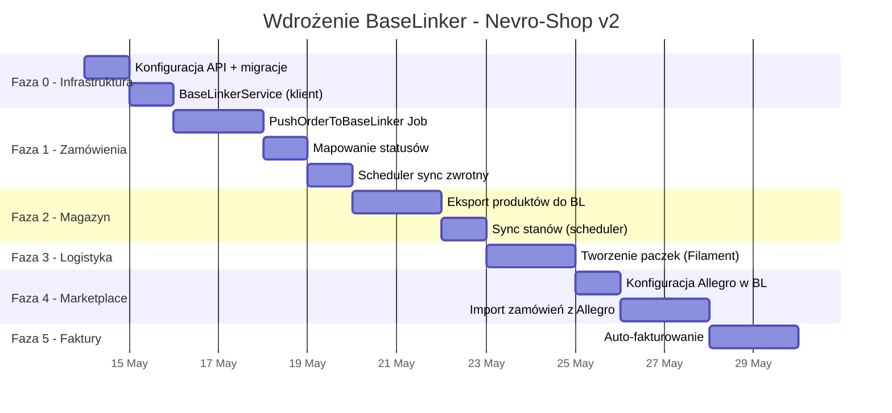

# Plan Wdrożenia BaseLinker jako Centrum Dowodzenia Nevro-Shop v2

> **Data:** 2026-05-13  
> **Projekt:** nevro-shop-v2 (Laravel 11 / TALL Stack / PostgreSQL)  
> **API:** `POST https://api.baselinker.com/connector.php` + nagłówek `X-BLToken`

---

## 1. Architektura Integracji

```
┌─────────────────────────────────────────────────────────────────┐
│                    NEVRO-SHOP v2 (Laravel 11)                   │
│                                                                 │
│  ┌──────────────┐  ┌──────────────┐  ┌───────────────────────┐  │
│  │ Order Model  │  │Product Model │  │  ShippingService      │  │
│  │ (PostgreSQL) │  │ (PostgreSQL) │  │  CartService          │  │
│  └──────┬───────┘  └──────┬───────┘  └───────────┬───────────┘  │
│         │                 │                      │              │
│  ┌──────▼─────────────────▼──────────────────────▼───────────┐  │
│  │              BaseLinkerService (NOWY)                      │  │
│  │  • apiCall(method, params)                                │  │
│  │  • pushOrder(Order)                                       │  │
│  │  • syncStock(Product[])                                   │  │
│  │  • createShipment(Order, courier)                         │  │
│  └──────────────────────┬────────────────────────────────────┘  │
│                         │                                       │
│  ┌──────────────────────▼────────────────────────────────────┐  │
│  │         BaseLinkerSyncCommand (Artisan Scheduler)         │  │
│  │  • bl:sync-orders      (co 5 min)                        │  │
│  │  • bl:sync-stock       (co 15 min)                       │  │
│  │  • bl:create-shipment  (on-demand / po zmianie statusu)  │  │
│  └──────────────────────┬────────────────────────────────────┘  │
└─────────────────────────┼───────────────────────────────────────┘
                          │ HTTPS POST
                          ▼
            ┌─────────────────────────┐
            │   BaseLinker Cloud API  │
            │  connector.php          │
            └─────┬──────┬──────┬────┘
                  │      │      │
            ┌─────▼─┐ ┌──▼──┐ ┌▼──────┐
            │Allegro│ │DPD  │ │Faktu- │
            │Erli   │ │DHL  │ │rownia │
            │Empik  │ │InPost│ │KSeF   │
            └───────┘ └─────┘ └───────┘
```

### Dlaczego taka architektura?

| Decyzja | Uzasadnienie |
| --- | --- |
| **Jeden serwis (`BaseLinkerService`)** | Centralizacja logiki API. Jeden punkt do mockowania w testach. |
| **Scheduler zamiast webhooków** | BaseLinker nie ma natywnych webhooków push. Polling jest standardem. |
| **Kolumna `baselinker_id` w modelach** | Mapowanie 1:1 między lokalnymi rekordami a obiektami w BL. |
| **Queue (Laravel Jobs)** | Asynchroniczne wysyłanie zamówień, aby nie blokować checkout. |

---

## 2. Fazy Wdrożenia

### Faza 0: Przygotowanie Infrastruktury (1 dzień)

| # | Zadanie | Pliki | Opis |
| --- | --- | --- | --- |
| 0.1 | **Konfiguracja API** | `.env`, `config/services.php` | Dodanie klucza `BASELINKER_API_TOKEN` |
| 0.2 | **Migracja: `baselinker_id`** | `database/migrations/` | Dodanie kolumny `baselinker_id` (nullable, bigint) do tabel `orders` i `products` |
| 0.3 | **BaseLinkerService** | `app/Services/BaseLinkerService.php` | Klasa klienta API z metodą `apiCall(string $method, array $params): array` |

#### Przykładowa konfiguracja `.env`:
```dotenv
BASELINKER_API_TOKEN=your-token-here
BASELINKER_INVENTORY_ID=12345
```

#### Przykładowa konfiguracja `config/services.php`:
```php
'baselinker' => [
    'token' => env('BASELINKER_API_TOKEN'),
    'inventory_id' => env('BASELINKER_INVENTORY_ID'),
    'api_url' => 'https://api.baselinker.com/connector.php',
    'order_source_id' => env('BASELINKER_ORDER_SOURCE_ID', 0),
],
```

#### Szkielet `BaseLinkerService`:
```php
<?php

namespace App\Services;

use Illuminate\Support\Facades\Http;
use Illuminate\Support\Facades\Log;
use Exception;

class BaseLinkerService
{
    protected string $apiUrl;
    protected string $token;

    public function __construct()
    {
        $this->apiUrl = config('services.baselinker.api_url');
        $this->token = config('services.baselinker.token');
    }

    /**
     * Uniwersalna metoda wywołania API BaseLinkera.
     * Cała komunikacja przechodzi przez ten jeden punkt.
     */
    public function apiCall(string $method, array $params = []): array
    {
        $response = Http::asForm()
            ->withHeaders(['X-BLToken' => $this->token])
            ->post($this->apiUrl, [
                'method' => $method,
                'parameters' => json_encode($params),
            ]);

        if (!$response->successful()) {
            Log::error("BaseLinker API error", [
                'method' => $method,
                'status' => $response->status(),
                'body' => $response->body(),
            ]);
            throw new Exception("BaseLinker API call failed: {$method}");
        }

        $data = $response->json();

        if (isset($data['status']) && $data['status'] === 'ERROR') {
            Log::error("BaseLinker API returned error", [
                'method' => $method,
                'error_code' => $data['error_code'] ?? 'unknown',
                'error_message' => $data['error_message'] ?? 'unknown',
            ]);
            throw new Exception("BaseLinker: " . ($data['error_message'] ?? 'Unknown error'));
        }

        return $data;
    }
}
```

---

### Faza 1: Synchronizacja Zamówień → BaseLinker (3-4 dni)

**Cel:** Każde zamówienie złożone w Nevro-Shop automatycznie pojawia się w panelu BaseLinkera.

| # | Zadanie | Typ | Metoda BL API | Opis |
| --- | --- | --- | --- | --- |
| 1.1 | **Job: PushOrderToBaseLinker** | `app/Jobs/` | `addOrder` | Wysłanie zamówienia po `convertToOrder()` w `CartService` |
| 1.2 | **Mapowanie statusów** | `config/baselinker.php` | `getOrderStatusList` | Mapowanie statusów Nevro (`pending`, `paid`, `shipped`…) na statusy BL |
| 1.3 | **Sync zwrotny statusów** | `app/Console/Commands/` | `getOrders` | Scheduler co 5 min pobiera zmienione statusy z BL i aktualizuje `Order::transitionTo()` |
| 1.4 | **Deduplikacja** | Logika w Job | — | Sprawdzenie `baselinker_id` przed ponownym pushem (idempotentność) |

#### Mapowanie pól `Order` → `addOrder`:

```php
public function pushOrder(Order $order): int
{
    $order->load('items');

    $products = $order->items->map(fn($item) => [
        'storage'    => 'db',
        'storage_id' => 0,
        'product_id' => $item->product_sku,
        'name'       => $item->product_name,
        'sku'        => $item->product_sku,
        'quantity'   => $item->quantity,
        'price_brutto' => (float) $item->price,
        'tax_rate'   => 23,
    ])->toArray();

    $shipping = $order->shipping_address ?? [];

    $result = $this->apiCall('addOrder', [
        'order_status_id' => $this->mapStatus($order->status),
        'date_add'        => $order->ordered_at?->timestamp ?? now()->timestamp,
        'currency'        => 'PLN',
        'payment_method'  => $order->payment_method_label,
        'paid'            => $order->payment_status === 'paid' ? 1 : 0,
        'user_login'      => $order->email,
        'phone'           => $order->phone ?? '',
        'email'           => $order->email,
        'user_comments'   => '',
        'admin_comments'  => "Zamówienie z Nevro-Shop: {$order->order_number}",
        'delivery_fullname'  => $shipping['name'] ?? $order->name,
        'delivery_address'   => $shipping['address'] ?? '',
        'delivery_city'      => $shipping['city'] ?? $order->city,
        'delivery_postcode'  => $shipping['zip'] ?? $order->zip,
        'delivery_country_code' => 'PL',
        'delivery_method'    => $order->shipping_method ?? 'Kurier',
        'delivery_price'     => (float) $order->shipping_cost,
        'want_invoice'       => $order->wants_invoice ? 1 : 0,
        'invoice_nip'        => $order->nip ?? '',
        'products'           => $products,
    ]);

    $blOrderId = $result['order_id'];

    // Zapisz ID BaseLinkera w naszej bazie
    $order->update(['baselinker_id' => $blOrderId]);

    return $blOrderId;
}
```

#### Integracja z istniejącym kodem (hook w `CartService::convertToOrder`):

```php
// Na końcu convertToOrder(), po return $order:
dispatch(new \App\Jobs\PushOrderToBaseLinker($order));
```

---

### Faza 2: Synchronizacja Stanów Magazynowych (2-3 dni)

**Cel:** Dwukierunkowa synchronizacja ilości produktów między bazą PostgreSQL a magazynem BL.

| # | Zadanie | Typ | Metoda BL API | Kierunek |
| --- | --- | --- | --- | --- |
| 2.1 | **Eksport produktów** | Command | `addInventoryProduct` | Nevro → BL |
| 2.2 | **Sync stanów** | Command (scheduler) | `getInventoryProductsStock` | BL → Nevro |
| 2.3 | **Push po sprzedaży** | Event Listener | `updateInventoryProductsStock` | Nevro → BL |

#### Strategia synchronizacji:

```
Nevro-Shop jest MASTER dla:
  • Nazw, opisów, zdjęć, cen (autorski content)
  • Tworzenia nowych produktów

BaseLinker jest MASTER dla:
  • Stanów magazynowych (bo agreguje z wielu kanałów: Allegro, Erli itd.)
  • Statusów przesyłek (bo zarządza kurierami)
```

#### Command `bl:sync-stock`:

```php
// app/Console/Commands/SyncBaseLinkerStock.php
public function handle(BaseLinkerService $bl)
{
    $inventoryId = config('services.baselinker.inventory_id');

    $result = $bl->apiCall('getInventoryProductsStock', [
        'inventory_id' => $inventoryId,
    ]);

    foreach ($result['products'] ?? [] as $blProductId => $stockData) {
        $product = Product::where('baselinker_id', $blProductId)->first();
        if ($product) {
            // Suma stanów ze wszystkich magazynów BL
            $totalStock = array_sum($stockData['stock'] ?? []);
            $product->update(['quantity' => $totalStock]);
        }
    }

    $this->info("Zsynchronizowano stany magazynowe z BaseLinker.");
}
```

---

### Faza 3: Logistyka i Listy Przewozowe (2 dni)

**Cel:** Generowanie listów przewozowych dla kurierów (DPD, DHL, InPost) bezpośrednio z panelu Filament.

| # | Zadanie | Typ | Metoda BL API |
| --- | --- | --- | --- |
| 3.1 | **Pobranie listy kurierów** | Setup (jednorazowo) | `getCouriersList`, `getCourierAccounts` |
| 3.2 | **Tworzenie paczki** | Akcja Filament | `createPackage` |
| 3.3 | **Pobranie etykiety** | Akcja Filament | `getLabel` |
| 3.4 | **Śledzenie przesyłki** | Command (scheduler) | `getCourierPackagesStatusHistory` |

#### Akcja w panelu Filament (przycisk "Nadaj paczkę"):

```php
// Filament Action na OrderResource
Action::make('createShipment')
    ->label('Nadaj paczkę')
    ->icon('heroicon-o-truck')
    ->action(function (Order $record, BaseLinkerService $bl) {
        $result = $bl->apiCall('createPackage', [
            'order_id'   => $record->baselinker_id,
            'courier_code' => 'dpd',  // lub 'inpost', 'dhl'
            // pola kuriera z getCourierFields
        ]);

        Notification::make()
            ->title("Paczka utworzona: {$result['package_id']}")
            ->success()
            ->send();
    })
    ->visible(fn(Order $record) => $record->baselinker_id !== null),
```

---

### Faza 4: Marketplace – Allegro, Erli, Empik (3-4 dni)

**Cel:** Sprzedaż produktów Nevro na zewnętrznych platformach z jednego panelu.

> [!IMPORTANT]
> Nevro-Shop NIE łączy się z Allegro bezpośrednio. Całość obsługuje BaseLinker.

| # | Zadanie | Typ | Opis |
| --- | --- | --- | --- |
| 4.1 | **Konfiguracja w panelu BL** | Manualna | Podłączenie konta Allegro/Erli w ustawieniach BL |
| 4.2 | **Eksport katalogu** | Command | Push produktów do BL Inventory → BL automatycznie wystawia na Allegro |
| 4.3 | **Import zamówień z Allegro** | Scheduler | `getOrders` z filtrem `source` = Allegro → zapis jako zamówienie w Nevro |
| 4.4 | **Sync cen i stanów** | Scheduler | Wykorzystanie Fazy 2 – BL propaguje zmiany do wszystkich kanałów |

#### Przepływ zamówienia z Allegro:

```
Klient kupuje na Allegro
       ↓
BaseLinker rejestruje zamówienie
       ↓
bl:sync-orders (scheduler co 5 min)
       ↓
Nevro tworzy Order z source='allegro'
       ↓
Nevro dekrementuje stock (atomowo)
       ↓
bl:sync-stock → aktualizuje BL → BL aktualizuje Allegro
```

---

### Faza 5: Fakturowanie (2 dni)

**Cel:** Automatyczne wystawianie faktur po opłaceniu zamówienia.

| # | Zadanie | Metoda BL API | Opis |
| --- | --- | --- | --- |
| 5.1 | **Konfiguracja serii faktur** | `getSeries` | Pobranie dostępnych serii faktur z BL |
| 5.2 | **Auto-faktura po płatności** | `addInvoice` | Trigger w webhook P24 → po `paid` → `addInvoice` |
| 5.3 | **Pobranie PDF** | `getInvoiceFile` | Link do pobrania faktury w mailu potwierdzającym |

```php
// W webhookach Przelewy24/Tpay, po potwierdzeniu płatności:
if ($order->wants_invoice && $order->baselinker_id) {
    $bl = app(BaseLinkerService::class);
    $bl->apiCall('addInvoice', [
        'order_id'  => $order->baselinker_id,
        'series_id' => config('services.baselinker.invoice_series_id'),
    ]);
}
```

---

## 3. Harmonogram Wdrożenia



**Szacowany czas wdrożenia: 12-16 dni roboczych**

---

## 4. Wymagania Wstępne

| # | Wymaganie | Status | Uwagi |
| --- | --- | --- | --- |
| 1 | Konto BaseLinker (aktywne) | ⬜ Do założenia | [baselinker.com](https://baselinker.com) – plan od ~99 PLN/m-c |
| 2 | Token API BaseLinker | ⬜ Do wygenerowania | Panel BL → Ustawienia → API |
| 3 | Konto kurierskie (DPD/DHL/InPost) | ⬜ Do podłączenia | Podpięcie w panelu BL |
| 4 | Konto Allegro (opcjonalne) | ⬜ Do podłączenia | OAuth w panelu BL |
| 5 | Seria faktur w BL | ⬜ Do skonfigurowania | Panel BL → Faktury → Serie |

---

## 5. Testy Akceptacyjne (Checklista)

### Faza 1 – Zamówienia
- [ ] Złożenie zamówienia w Nevro → pojawia się w panelu BL w ciągu 30s
- [ ] Status zamówienia zmieniony w BL → aktualizuje się w Filament w ciągu 5 min
- [ ] Duplikat zamówienia NIE jest tworzony przy retry/restarcie kolejki

### Faza 2 – Magazyn
- [ ] Produkt dodany w Filament → pojawia się w BL Inventory
- [ ] Zmiana stanu w BL → aktualizuje `products.quantity` w PostgreSQL
- [ ] Sprzedaż w Nevro → zmniejsza stan w BL → zmniejsza stan na Allegro

### Faza 3 – Logistyka
- [ ] Przycisk "Nadaj paczkę" w Filament → tworzy list przewozowy w BL
- [ ] Etykieta PDF do pobrania z poziomu panelu
- [ ] Numer śledzenia widoczny na stronie statusu zamówienia

### Faza 5 – Faktury
- [ ] Po opłaceniu zamówienia z `wants_invoice=true` → faktura wystawiona w BL
- [ ] PDF faktury dostępny w mailu potwierdzającym
